# elt-pipeline
<p align="center">
  
</p>


<h2>💁‍♂️ 팀원</h2>

<table align="center">
  <thead>
    <tr>
      <th>PM/TL</th>
      <th>Data</th>
      <th>Dev</th>
      <th>Infra</th>
    </tr>
  </thead>
  <tbody align="center">
    <tr>
      <td></td>
      <td></td>
      <td></td>
      <td></td>
    </tr>
    <tr>
      <td><a href="https://github.com/klolarion">김재근</a></td>
      <td><a href="https://github.com/why-arong">김필모</a></td>
      <td><a href="https://github.com/ostar11">조정완</a></td>
      <td><a href="https://github.com/hansususu">한수빈</a></td>
    </tr>
  </tbody>
</table>

---

#  📝 프로젝트 개요
농업 생산자들이 시장 가격, 재배 정보, 날씨 정보를 쉽게 확인할 수 있는 서비스를 제공합니다.<br/>
기존의 복잡한 정보 검색 과정 없이, 시각화된 데이터와 챗봇 기반 질문 응답을 통해 누구나 쉽게 의사결정을 할 수 있도록 돕습니다.

# 💻 주요 기능
- **로그인**:
  - 소셜인증 후 JWT기반 인증 관리
 
- **회원가입**:
  - 소셜인증 성공 후 자동 가입
  - 일반/농업 사용자 등록 후 최종 사용 승인

- **챗봇**:
  - 지역 예보 확인
  - 품목 가격 검색
  - 목표 경락가 알림 등록
  - 기타 농업 질문

- **시각화된 가격정보**:
  - 년/월/일 단위의 가격추이
  - 실시간 경락가
  - 품질(특,상,중,등외)별 가격
  - 지역별 가격
  - 품종별 생산지 -> 판매지 흐름 분석

- **적합도 분석**:
  - 대상 농지의 토양,기상 특성과 작물의 재배특성으로 재배 적합도 분석

- **푸시 알림**:
  - 기상 특보
  - 목표 경락가 도달

---
# 📱 주요 화면 구성

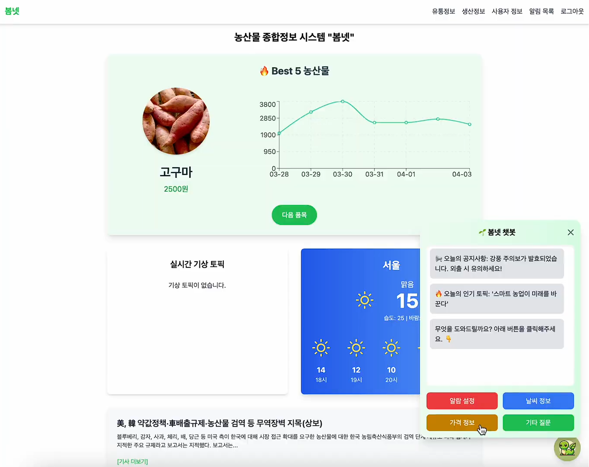
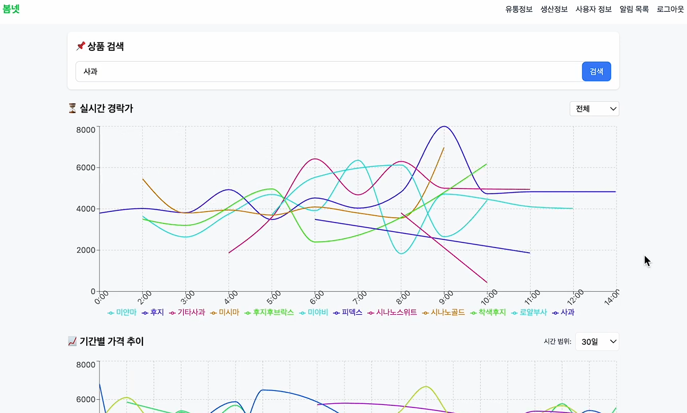
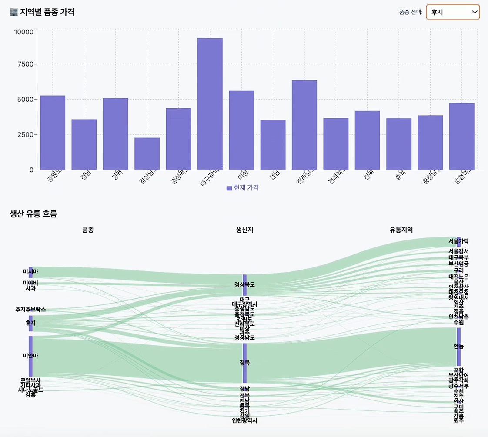
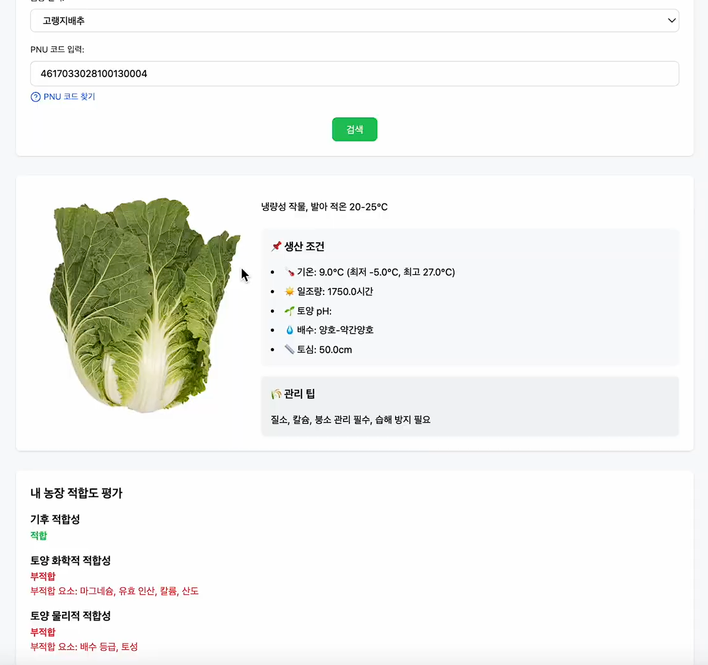
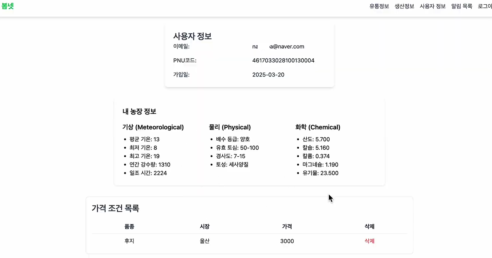
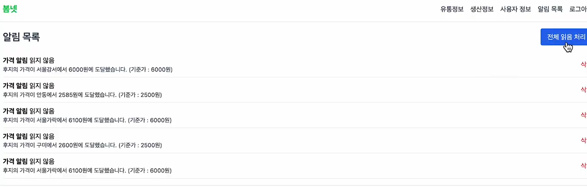

---

# ⚙ 기술 스택

### Frontend


### Backend


### Infra


### CD/CI


### Data


### Tools


### API


---
# 📦 프로젝트 구조
```plaintext

BomNet/                      # 프로젝트 메인
├── airflow/                 
├── frontend/               
├── backend/
│   ├── auth                 # 인증서버
│   ├── core                 # 코어서버
│   ├── llm                  # 챗봇서버
│   └── notification         # 알림서버
├── terraform/              
├── fluent_bit/              
├── kibana/                  
├── jenkins/                
├── docs/                    # 각종 프로젝트 문서
└── README.md                # 프로젝트 개요

BomArgo/                     # ArgoCD 배포
├── auth/                 
├── core/            
├── llm/            
├── notification/            
├── redis/            
├── front/            
└── README.md                

BomLocust/                   # 부하 테스트
└── locust.py

elt-pipeline/                # 데이터 파이프라인
├── airflow-local/                 
├── gcp-terraform/            
├── mafra/            
├── schemas/            
└── README.md                

```
---

## 🔁 Git Workflow
### Github 브랜치 관리
- 브랜치 흐름
  - dev → 개인 브랜치(작업) → dev 병합

- 브랜치 네이밍 규칙
  - 이름(닉네임)-모듈-작업내용
  - ex) JK-Frontend-상품페이지구현

### Github 커밋 메시지
- 형식
  - 목적/해당 모듈-이름(닉네임)
  - ex) feat/AuthService-JK
- Prefix
  - feat/ - 신규 개발
  - up/ - 기존 코드 수정
  - fix/ - 오류 수정
  - docs/ - 문서 관련 작업

### PR 템플릿

✨ 작업 개요 (Overview)

🔑 주요 변경 사항 (Changes)

📸 스크린샷 (Optional)

📝 기타 (Notes)

---

# 🛠️ 프로젝트 아키텍처
- ### Cloud
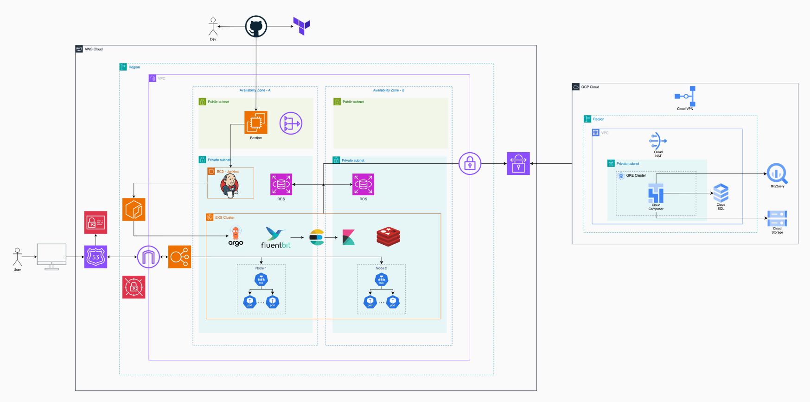
- ### EKS
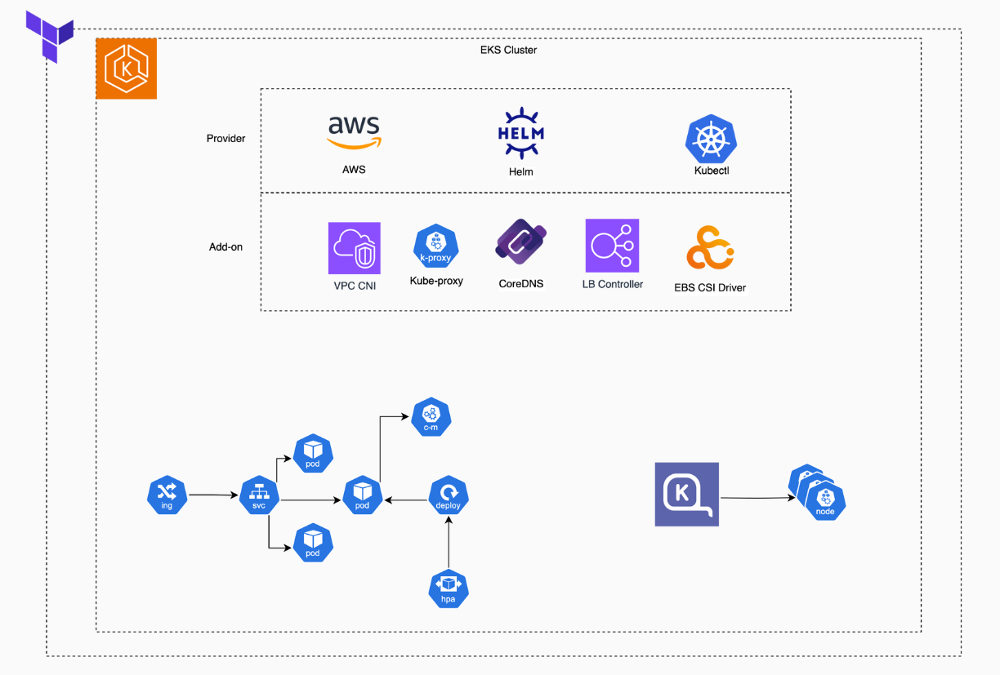
- ### CD/CI
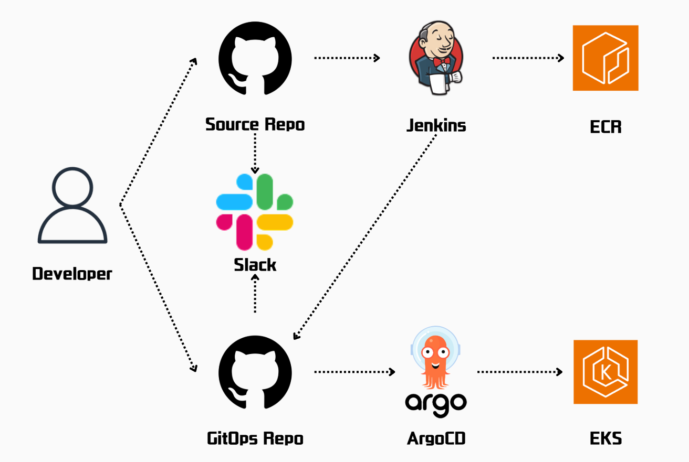
- ### DR
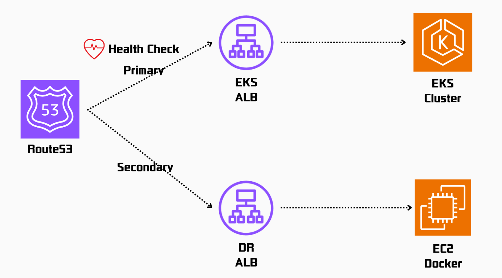
- ### Service
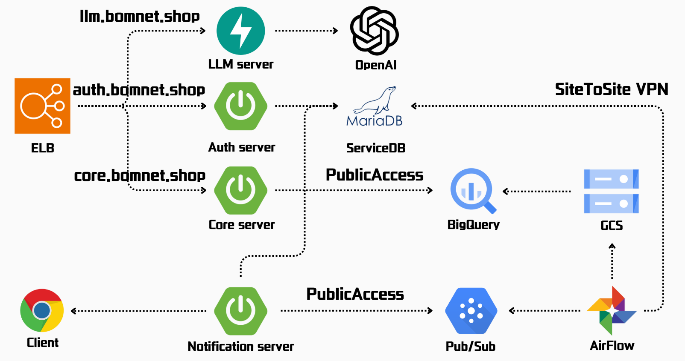
- ### Cache
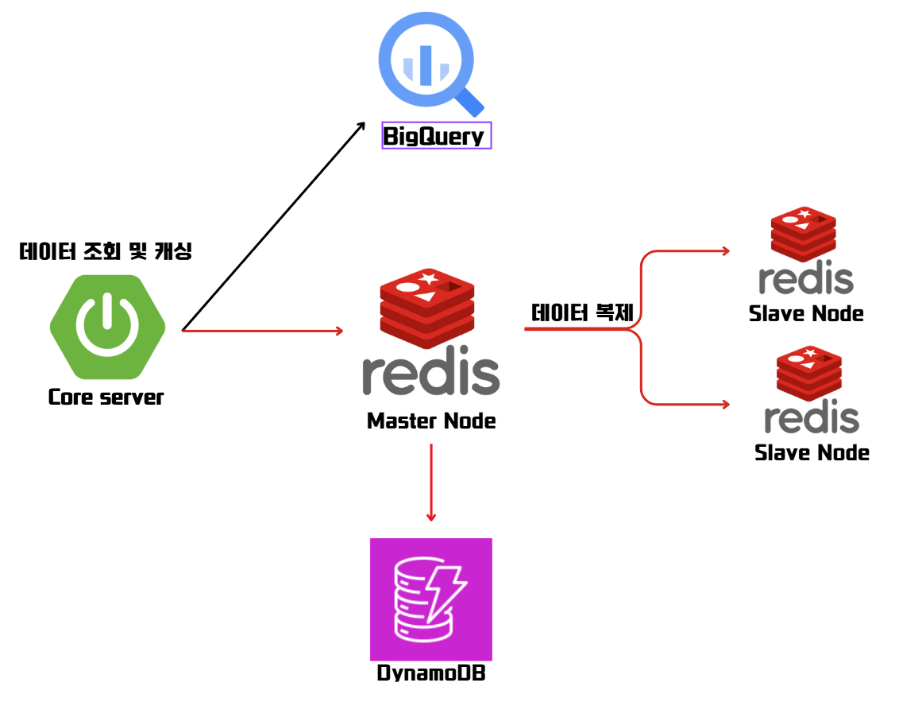
- ### Data
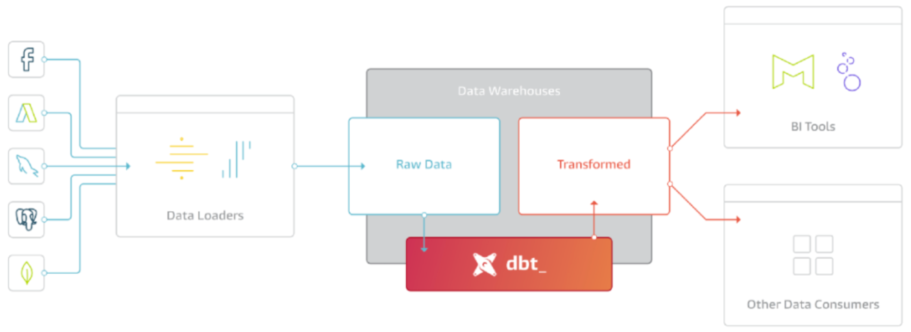
